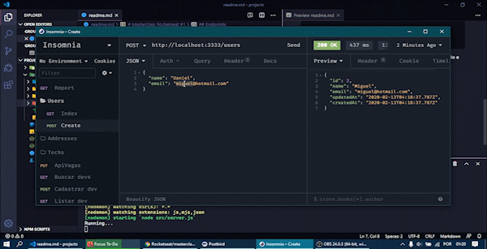

# Masterclass Rocketseat #1

Código que usa as tecnologias Node.js e Sequelize ORM em conexão com o banco PostgreSQL com relacionamentos de 1:1, 1:N e N:N.




## Endpoints
POST :: /users = insere usuários no banco de dados
```json
{
  "name": "Daniele S",
  "email": "daniele@gmail.com"
}
```
GET :: /users = retorna usuários do banco de dados  
POST :: /users/:user_id/addresses = adiciona endereço do usuário
```json
{
	"zipcode": "45600000",
	"street": "Rua Tosta Filho",
	"number": 22
}
```
GET :: /users/:user_id/addresses = retorna endereço do usuário  
POST :: /users/:user_id/techs = adiciona tecnologia para usuário
```json
{
	"name": "React Native"
}
```
GET :: /users/:user_id/techs = retorna tecnologias do usuário  
DELETE :: /users/:user_id/techs = apaga tecnologia do usuário
```json
{
	"name": "Node.js"
}
```
GET :: /report = Retorna relatório simples com informações do usuário e tecnologias

## Executando localmente
- Para rodar localmente, é necessário instalar as dependências com `npm install` na pasta.  
- Configurar as informações do do banco de dados.  
- Criar o banco com: `yarn sequelize db:create`
- Como as *migrations* já estão na pasta, basta rodar `yarn sequelize db:migrate`

Após conferir se as tabelas foram propagadas no banco, pode-se startar com `yarn dev` e testar os endpoints. :fire: